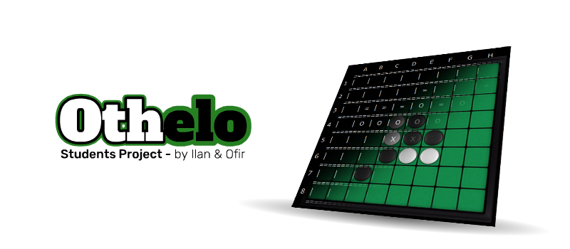
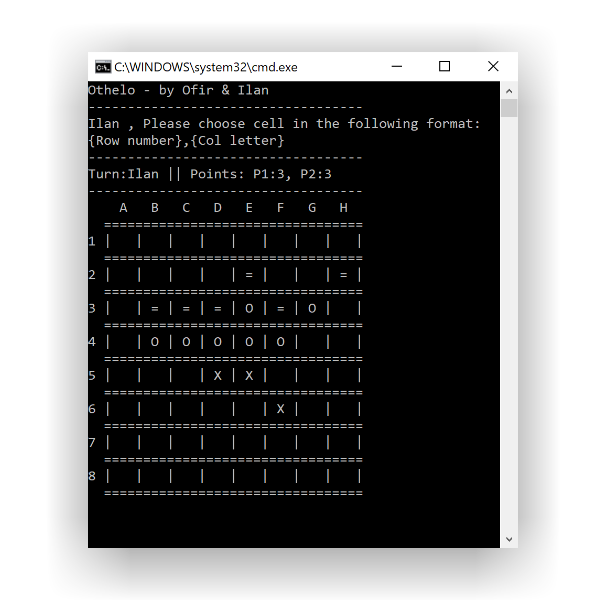

<h1 align="center">Othelo</h1>

<strong>Console Edition - by Ilan & Ofir</strong>
 Students project for C# & .Net Framework course - The Academic College of Tel Aviv - Yaffo

 

</img>

<h2>About</h2>
This is an Othelo game, coded using C# for our CS degree.
 We built the console edition and will expand its UI in the near future...
 Have fun and try to beat the PC ;)

<h2>Goal and requirements</h2>

The idea was to practice OOP, C#'s Arrays and other collection classes and using an outer assembly in the project.

<h2>Key learnings</h2>

- OOP 
- Arrays
- Lists
- Using outer Dll
- string
- C# syntax
- Microsoft Visual Studio .NET dev tools
- Access modifiers
- Constructors
- Properties
- Indexers

After submission we've improved more the styling and the classes organization.

<h2>Installation</h2>

1. Download this project as zip and extract it
2. Run the .exe file
3. Play!

<h2>Contributing</h2>
no need for now :)

<h2>Project status</h2>
Completed

<h2>Credits</h2>

- Authors: <a href="mailto:ilan.kushnir@gmail.com" target="_blank">Ilan Kushnir</a>, <a href="mailto:ofir5300@gmail.com" target="_blank">Ofir Cohen</a>
- Logo & Design: <a href="mailto:ilan.kushnir@gmail.com" target="_blank">Ilan Kushnir</a>
- Instructor: <a href="https://www.facebook.com/guy.ronen" target="_blank">Guy Ronen</a>
- <a href="https://www.mta.ac.il/" target="_blank">The Academic College of Tel Aviv - Yaffo</a>

<h2>Copyright</h2>
This project is licensed under the terms of the MIT license 
